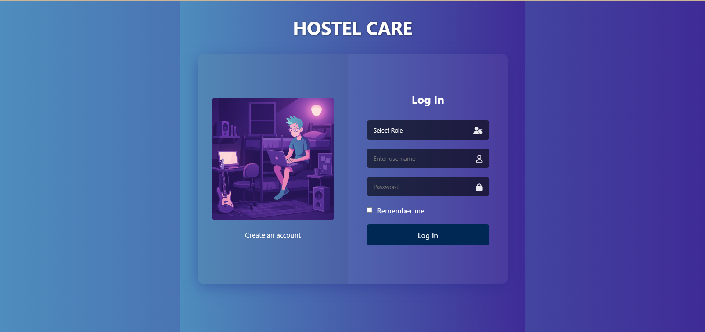
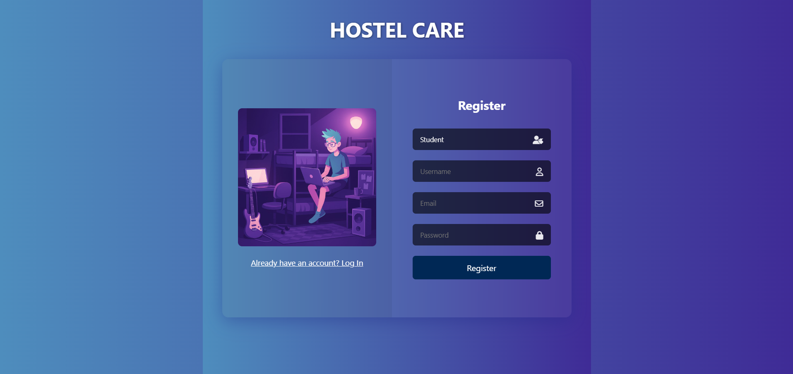
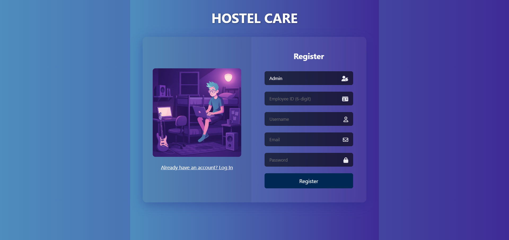
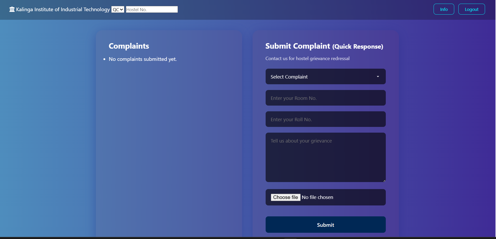
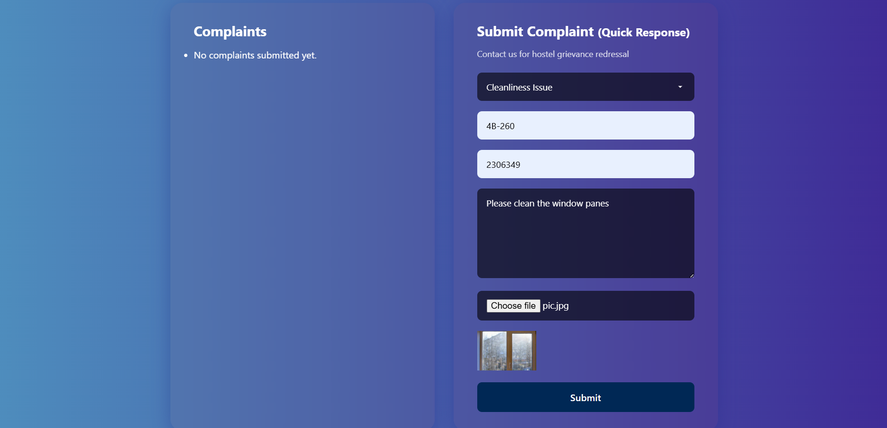
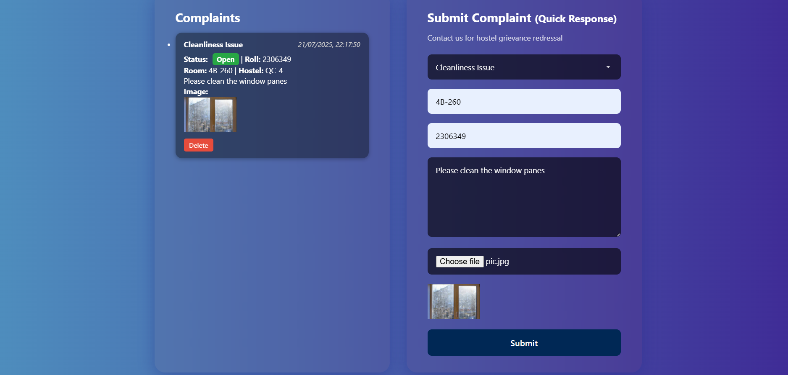
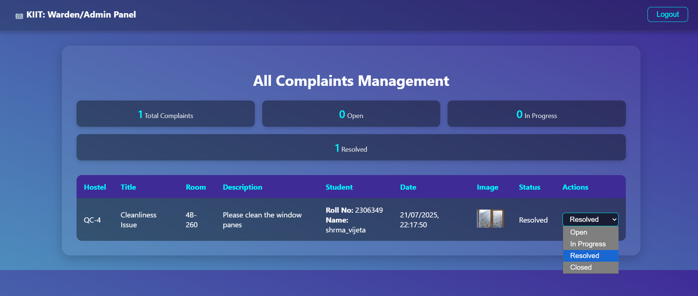

# Hostel Care – Hostel Complaint Management System

A full-stack web application for managing hostel complaints submitted by students and handled by wardens.

## Features

-  Simple and intuitive interface for students to register complaints
-  OTP-based login with Employee ID validation for warden/admin
-  Image upload with live preview for complaint evidence
-  Dashboard for tracking complaints by status
-  Secure session handling using Flask sessions
-  Modern glassmorphism UI with mobile-responsive design

## Tech Stack

- **Frontend**: HTML, CSS, JavaScript
- **Backend**: Python (Flask)
- **Database**: MongoDB Atlas
- **Styling**:  Glassmorphism
- **Other**: OTP login, session security, role-based access

##  Project Screenshots

###  Login Page

###  Student Register

###  Admin Register


### Student Dashboard


### Submit Complaint


### Complaint Submitted

### Warden Dashboard

### Status Update


---

## Folder Structure

```bash
Hostel_Care/
├── app.py
├── static/
├── templates/
├── images/
│   ├── login.png
│   ├── studentDashboard.png
│   └── ...
└── README.md
